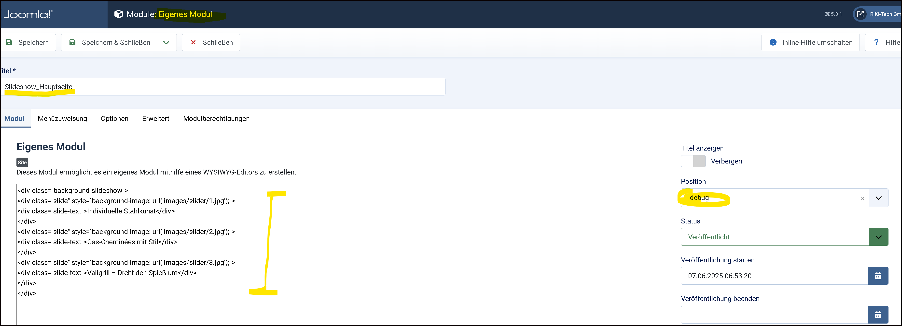

- Joomla Installieren

- Favicon und Bilder und Logos hochladen

- Inhalt -> Beiträge -> Optionen -> Bearneitungslayout ->  Bilder und Links im Frontend --> Anzeigen

- Inhalt -> Beiträge -> Optionen -> Beiträge -> Position der Beitragsinfo -> darunter (HTML Ausgabe)
   (Damit auch Bilder geändert werden können voa Frontend)

Default setzen für Beiträge --> Bild noch erstellen

- System -> Verwalten -> Erweiterungen -> COm_content  ????? 

- Child Template erstellen -> mit Name -> Keine unnötigen Overrides unabsichtlich erstellen !!!

- Logo im Child Template hinterlegen
   --> Stiky Header Fluid ???

- Kontakt erstellen für Kontaktormular

- Kategorien eröffnen wo Nötig Unterkategorien Bsp. Maschinen Park --> Maschinen

- Schlagwort erstellen --> für Kategorie Blog 

- Beitrag erstellen mit Kategorie 

- Menü erste Uberschriften erstellen

- user.scc kopieren -> ev. automatisiert mit FTP .vscode/sftp.json

- [Zur Dokumentation JS ](../JavaScript/README.md)
user.js  kopieren

- Main Menü fertig anpassen 

Startseite Dummy

Slidesshow modul erstellen mit ausgabe in Bereich Debug
